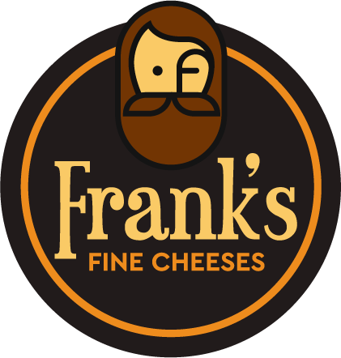

# FineCheeseApp
Frank's Fine Cheeses. Purveyors of the finest cheeses in the world. The Frank Cheese App gives the user the ability to have access to gourment cheeses in Los Angeles County. Upon loading the app the user is able to enter their zip code to discover the available specials in their community. The user is able to search for any cheese in the Frank database according to Country or by Cheese Name. Once the user has selected all the desired cheeses they are then taken to the checkout screen. The checkout screen provides them with a list of all the cheeses in their basket and the quantity for each cheese. The cheeses on discount list the percent discount and have that calculated in their total listed at the bottom of the screen. 

## Project
This project is a full stack application. It has a database, server and a front end client. The data began as a csv file and then, utilizing javascript, it was converted into JSON and then transfered to a Mongo Database. The Server, API and Client are all built with JavaScript and Node. The API is designed to locate individual cheeses and specials as well as calling the entire database. The Front End framework utilizes React. Other technologies used are: Express, Styled-Components, Webpack, and Babel.

## Structure
Thist app is a single page web application. The entry point on the client is in the client/src folder. The index.jsx file immediatly directs to the CheeseStore.jsx file. This is the main page for the app. Conditional rendering is utilized to direct the user to the different pages depeding on where they are in the process. The Components File has the reusable components that are broken down from Atoms (smallest) to Organisms(more complex). The src file also contains all the Assets and Fonts. The dist folder contains the bundle (which will be automatically placed there upon compile) and the index.html entrypoint. 

## To Download and Run App
* Copy Repo from GitHub and Clone to Local Machine
1. RUN: 'npm install' - this will install all the node modules to the app
* If you want to add the database to your local machine and you already have MongoDB installed on your machine, you can add the pertinent details for your local Mongo instance as a string in a DATABASE variable in a .env file in the root directory.Then you can run the command:'npm run seed' from the terminal to seed the database. This will seed your database. The app is currently configured to call the database deployed on the Mongo cloud. 
2. RUN: 'npm run build' - this will compile the code and place it in a bundle file
3. RUN: 'npm start' - this will start the server. 
4. You should be able to enter http://localhost:PORT/ to see a working version of the app. 
